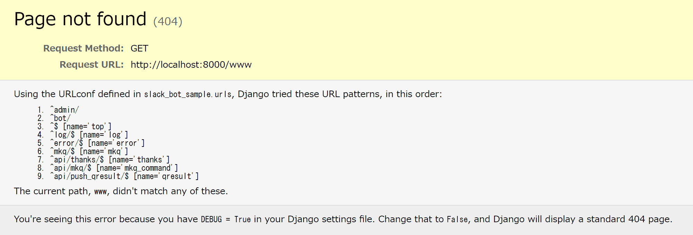
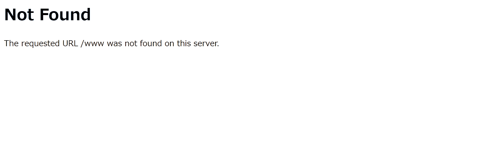

Djangoで存在しないURLにアクセスすると以下のような404ページが表示されます。  

**デバックモード**



**本番モード**

  
 
通常はデバックモードでサイトの運営はしないと思うので本番モードのシンプルな、というか味気ない404ページが表示されてしまいます。  
まあ、シンプルな方が良いという人はこのままでも良いのですが、折角なら自分のサイトの雰囲気に合った親切な404ページを表示したいですよね。 

### let'sカスタマイズ
カスタマイズするのは物凄く簡単でtemplatesフォルダの直下に`404.html`のファイルを置くだけ。  
これだけで404エラーの時に自分の作った`404.html`が表示されるようになります。  
ただし、デバックモードにしていると冒頭に示したデバック用のページが表示されてしまうので本番モードで表示の確認をしてみて下さい。  
本番モードとデバックモードの切り替えは以下のように切り替えることができます。  
`settings.py`
```python
DEBUG = True # デバックモード
```
```python
DEBUG = False # 本番モード
```
404ページと同様の方法で他のエラーページもカスタマイズすることができます。  
500エラーをカスタマイズするならtemplatesフォルダ直下に`500.html`を作れば良いです。  

ちなみに404ページや500ページでもdjango templateが使えるので、expandsタグなどを使って共通部分を統一することもできます。  
当サイトでも利用しています。
