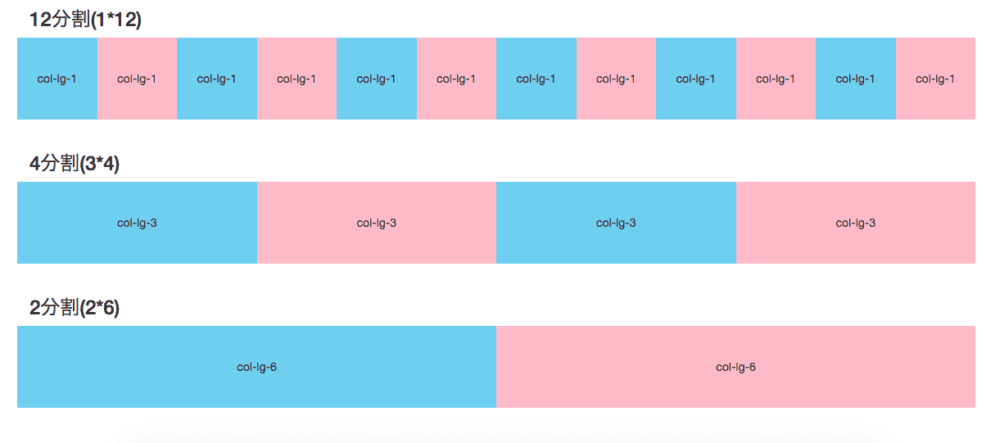

Djangoでブログを作る-最終回-です。  

### シリーズ一覧  
> 1. [プロジェクトの作成とアプリケーションの作成](/articles/68/)  
> 1. [view関数の書き方](/articles/69/)  
> 1. [URLの指定の仕方(URLディスパッチャ)](/articles/70/)  
> 1. [データベース(モデル)の設定](/articles/71/)  
> 1. [記事の投稿ページの作成](/articles/72/)  
> 1. [記事の一覧ページと詳細ページの追加](/articles/73/)  
> 1. [記事の編集ページと記事の削除機能の追加](/articles/74/)  
> 1. [いいね機能の追加](/articles/75/)
> 1. [コメント機能の追加](/articles/77/)
> 1. [Bootstrapを利用したwebデザイン](/articles/78/) <- 今回  

「Bootstrapを利用したwebデザイン」なんてつけてますが、おまけ程度にしかやらないのでそんなに期待しないでくださいね。  
基本的に筆者はデザイン得意じゃないんです...

## Bootstrapのグリッドシステム
Bootstrapには簡単にデザインを作れるように**グリッドシステム**が用意されています。  
Bootstrapで用意されているグリッドシステムは、一つの行(row)を12列(colume)に分割して、一つの要素にどれくらいの行を割り振るかで表現されます。  

イメージとしては以下の図のような感じです。  

具体的な利用例としては以下のような感じです。  
```html
<div class="container">
  <div class="row">
    <div class="col-4">
      すべての要素を均等に三分割
    </div>
    <div class="col-4">
      すべての要素を均等に三分割
    </div>
    <div class="col-4">
      すべての要素を均等に三分割
    </div>
  </div>
  <div class="row">
    <div class="col-2">
      要素を　1　: 
    </div>
    <div class="col-10">
      　5　に分割
    </div>
  </div>
</div>
```

グリッドシステムを利用したい要素全体を`class`に`container`を与えた要素で囲みます。  

`class`に`row`を与えるとその要素は行としてふるまいます。  

その中に`class`に`col-数字`を与えた要素を配置するとその行の中でXX列分の大きさの要素になります。  
この時に`数字`の合計が`12`になるようにします。  
12より小さい場合は問題ないのですが12より大きくなるとはみ出した部分が表示されなくなってしまったりします(カラム落ち)。  

上記のコードでは行を均等に三分割する例と1:5に分割する例を挙げています。  


### レスポンシブデザイン
同じサイトでもアクセスする端末が変わるとデザインが変わるサイトってありますよね。  

あれは、多くの場合画面の大きさに合わせて要素の配置の仕方を変えています。  

Bootstrapのグリッドシステムではこれを簡単に実現できます。  

PCで当サイトをご覧の方はブラウザの横幅を変えてみてください。  
大きさが変わると要素の配置が変わるはずです。  

これもBootstrapで実現しています。  

先ほど`col-数字`で行の分割ができるとお伝えしましたが、これに加えて画面の大きさを指定するフレーズを加えれば、画面の大きさに応じて分割幅を変えることができます。  

```html
<div class="container">
  <div class="row">
    <div class="col-12 col-md-6 col-lg-4">
      スマートフォンなら縦一列
    </div>
    <div class="col-12 col-md-6 col-lg-4">
      タブレットなら横に二つ
    </div>
    <div class="col-12 col-md-6 col-lg-4">
      PCなら横に三つ
    </div>
  </div>
  <div class="row">
    <div class="col-12 col-md-6 col-lg-4">
      スマートフォンなら縦一列
    </div>
    <div class="col-12 col-md-6 col-lg-4">
      タブレットなら横に二つ
    </div>
  </div>
</div>
```

`col-数字`が大体、スマートフォンサイズの画面。  
`col-md-数字`とすることでタブレットサイズの画面。  
`col-lg-数字`とすることでPCサイズの画面に対して大きさを指定できます。  

上の例ではスマートフォンサイズでは縦一列に、タブレットサイズなら横二つ、PCサイズなら横三つになるように指定しています。  

このように一つの要素に対して複数`class`を設定することで表示幅を切り替えています。  


#### ブレークポイント一覧

細かい数字などが気になる人はこちらをどうぞ  

> [Bootrtrap4のブレークポイント一覧](/articles/284/)  


## デザインを適用する
### Bootstrapの入手
以下のリンクからBootstrapをダウンロードできます。  
> Download · Bootstrap  
> https://getbootstrap.com/docs/4.1/getting-started/download/

### 静的ファイル
入手したBootstrap(cssファイル)はテンプレート(HTML)のようにDjangoによって動的に中身が書き換わるわけではありません。  

このようなファイルを静的ファイルといいます。  

cssファイルやjavascript、画像ファイルなどが多くの場合は静的ファイルです。  

Djangoで、これらをテンプレート(HTML)に読み込ませるには、少し手順が必要です。  

アプリケーションのディレクトリの中に`static`というディレクトリを作成します。  
```
myblog
├── blog
│   ├── admin.py
│   ├── apps.py
│   ├── __init__.py
│   ├── migrations
│   │   └── __init__.py
│   ├── models.py
│   ├── static # 新しく作る
│   ├── templates
│   │   └── blog
│   │       ├── article_all.html
│   │       ├── edit.html
│   │       ├── index.html
│   │       ├── new.html
│   │       └── view_article.html
│   ├── tests.py
│   ├── urls.py
│   └── views.py
├── manage.py
└── myblog
    ├── __init__.py
    ├── settings.py
    ├── urls.py
    └── wsgi.py
```
この中に静的ファイルを配置します。  

今回、ダウンロードしてきたBootstrapのファイル群は以下のように配置しました。  

```
myblog/blog/static/
├── css
│   ├── bootstrap.css
│   ├── bootstrap.css.map
│   ├── bootstrap-grid.css
│   ├── bootstrap-grid.css.map
│   ├── bootstrap-grid.min.css
│   ├── bootstrap-grid.min.css.map
│   ├── bootstrap.min.css
│   ├── bootstrap.min.css.map
│   ├── bootstrap-reboot.css
│   ├── bootstrap-reboot.css.map
│   ├── bootstrap-reboot.min.css
│   └── bootstrap-reboot.min.css.map
└── js
    ├── bootstrap.bundle.js
    ├── bootstrap.bundle.js.map
    ├── bootstrap.bundle.min.js
    ├── bootstrap.bundle.min.js.map
    ├── bootstrap.js
    ├── bootstrap.js.map
    ├── bootstrap.min.js
    └── bootstrap.min.js.map
```
`static`の中にそのまま解凍しただけです。  

設置したファイルは**テンプレートの一行目に``を加える**ことで利用できるようになります。  

```html
 <!-- 一行目に追加 -->
<!DOCTYPE html>
<html>
```
これを忘れるとエラーを吐かれるので注意してください。  

``を加えたうえで  
```django

```
(staticは含めない)と記述することで読み込めます。  

今回の例だと  
```html
<link rel="stylesheet" href="">
```
こんな感じになります。  

## デザインを適用する
というわけで、Bootstrapを使ってデザインを整えました。  
`index.html`
```html

<!DOCTYPE html>
<html>

<head>
  <meta charset="utf-8" />
  <title>my-blog-index</title>
  <meta name="viewport" content="width=device-width, initial-scale=1">
  <link rel="stylesheet" href="">
</head>

<body>
  <nav class="navbar navbar-dark bg-dark">
    <ul class="navbar-nav">
      <li class="nav-item">
        <a class="nav-link" href="">トップページ</a>
      </li>
    </ul>
  </nav>
  <div class="container">
    <div class="jumbotron">
      <h1 class="h3">とっぷぺーじ</h1>
    </div>
    <div class="row">
      <div class="col-12">
        <a class="btn btn-dark" href="">新規記事の投稿</a>
      </div>
      <div class="col-12">
        <a class="btn btn-dark" href="">投稿された記事一覧</a>
      </div>
    </div>

  </div>

</body>

</html>
```

`new.html`
```html

<!DOCTYPE html>
<html>

<head>
  <meta charset="utf-8" />
  <title>my-blog-new</title>
  <meta name="viewport" content="width=device-width, initial-scale=1">
  <link rel="stylesheet" href="">
</head>

<body>
  <nav class="navbar navbar-dark bg-dark">
    <ul class="navbar-nav">
      <li class="nav-item">
        <a class="nav-link" href="">トップページ</a>
      </li>
    </ul>
  </nav>

  <div class="container">
    <div class="jumbotron">
      <h1 class="h3">新規記事の投稿ページ</h1>
    </div>

    <form action="" method="post">
      
      <p><label for="title_input">記事のタイトル</label></p>
      <p><input class="form-control" type="text" name="title" id="title_input"></p>
      <p><label for="text_area">記事の本文</label></p>
      <p><textarea class="form-control" name="text" id="text_area" cols="30" rows="10"></textarea></p>
      <p><button class="btn btn-primary" type="submit">投稿</button></p>
    </form>
  </div>
</body>

</html>
```


`edit.html`
```html

<!DOCTYPE html>
<html>

<head>
  <meta charset="utf-8" />
  <title>my-blog-edit</title>
  <meta name="viewport" content="width=device-width, initial-scale=1">
  <link rel="stylesheet" href="">
</head>

<body>
  <nav class="navbar navbar-dark bg-dark">
    <ul class="navbar-nav">
      <li class="nav-item">
        <a class="nav-link" href="">トップページ</a>
      </li>
    </ul>
  </nav>
  <div class="container">

    <div class="jumbotron">
      <h1 class="h3">記事の編集ページ</h1>
    </div>
    
    <form action="" method="post">
      
      <p><label for="title_input">記事のタイトル</label></p>
      <p><input class="form-control" type="text" name="title" id="title_input" value="{{ article.title }}"></p>
      <p><label　for="text_area">記事の本文</label></p>
      <p><textarea class="form-control" name="text" id="text_area" cols="30" rows="10">{{ article.text }}</textarea></p>
      <p><button class="btn btn-primary" type="submit">更新</button><a class="btn btn-warning" href="">編集の取りやめ</a></p>
    </form>

  </div>
</body>

</html>
```

`article_all.html`
```html

<!DOCTYPE html>
<html>
<head>
  <meta charset="utf-8" />
  <title>article all</title>
  <meta name="viewport" content="width=device-width, initial-scale=1">
  <link rel="stylesheet" href="">
</head>
<body>
  <nav class="navbar navbar-dark bg-dark">
    <ul class="navbar-nav">
      <li class="nav-item">
        <a class="nav-link" href="">トップページ</a>
      </li>
    </ul>
  </nav>
  <div class="container">
    <div class="jumbotron">
      <h1 class="h3">投稿された記事一覧</h1>
    </div>

    <div class="row">
      
      <div class="col-12 col-md-6 col-lg-4">
        <div class="card">
          <div class="card-body">
            <div class="row">
              <div class="col-12">
                <a class="text-primary" href="">{{ article.title }}</a>
              </div>
              <div class="col-12">
                <small>[{{ article.posted_at }}]</small>
              </div>
              <div class="col-6">
                <a class="text-primary" href="">編集</a>
              </div>
              <div class="col-6">
                <a class="text-danger" href="">削除</a>
              </div>
            </div>
          </div>
        </div>
      </div>
      
    </div>
  </div>
</body>
</html>
```

`view_article.html`
```html

<!DOCTYPE html>
<html>
<head>
  <meta charset="utf-8" />
  <title>{{ article.title }}</title>
  <meta name="viewport" content="width=device-width, initial-scale=1">
  <link rel="stylesheet" href="">
  <script>
    function api_like() {
      var api_url = "";
      var btn = document.getElementById("like");
      var request = new XMLHttpRequest();
      request.onreadystatechange = function () {
          if (request.readyState === 4 && request.status === 200) {
              var received_data = JSON.parse(request.responseText);
              btn.innerText = received_data.like;
          }
      }
      request.open("GET", api_url);
      request.send();
    }
  </script>
</head>
<body>
  <nav class="navbar navbar-dark bg-dark">
    <ul class="navbar-nav">
      <li class="nav-item">
        <a class="nav-link" href="">トップページ</a>
      </li>
      <li class="nav-item">
        <a class="nav-link" href="">一覧へ戻る</a>
      </li>
    </ul>
  </nav>
  <div class="container">
    <div class="jumbotron">
      <h1 class="h3">{{ article.title }}</h1>
      <small>投稿日時 : {{ article.posted_at }}</small>
      <small>最終更新 : {{ article.last_modify }}</small>
    </div>
    <div class="row">
      <div class="col-12">
        <p>{{ article.text }}</p>
      </div>
      <p><a class="btn btn-primary text-white" onclick="api_like()"><span class="text-white" id="like">{{ article.like }}</span>いいね！</a></p>
    </div>
    <form action="" method="POST">
      <p><label for="com">コメント</label></p>
      
      <textarea class="form-control" name="text" id="com" cols="30" rows="10" required></textarea>
      <p><button class="btn btn-primary" type="submit">投稿</button></p>
    </form>
    
    
      <div class="card">
        <div class="card-body">
          <span>{{ comment.text }}</span>
          <span>-<small>{{ comment.posted_at }}</small></span>
        </div>
      </div>
    
      <p>コメントはありません</p>
    

  </div>
</body>
</html>
```

デザインが超手抜きなのは許してください。  
冒頭でも述べましたが、筆者はデザインが得意じゃないんです...  
~~そもそも致命的にセンスがない...~~   

## テンプレートを継承する
とりあえず勢いでデザインをしてみましたが、ものすごく長いコードになりました。  

よく見なくても***同じようなことがたくさん***書いてあります。  

***同じことがたくさん書いてある***

これは良くないですね。  

サイトのデザインを更新するときに何度もコピペで直さないといけません。  

コピペでコードを管理していると絶対にどこか書き換え忘れます。  

**コピペ、ダメ、ゼッタイ。**

なので、各ページで共通する部分は一か所で管理するようにします。  

``タグと``タグを利用します。  

詳しい利用方法は以下をご覧ください。  
> [[Django] これだけは知っておきたいテンプレートの基本文法](/articles/67/#%E3%83%96%E3%83%AD%E3%83%83%E3%82%AF%E5%8C%96(block))  


まずは、共通の部分を管理する骨格となるテンプレートを作成します。  
`templates/base/base.html`

`base.html`
```html

<!DOCTYPE html>
<html>
<head>
  <meta charset="utf-8" />
  <title></title>
  <meta name="viewport" content="width=device-width, initial-scale=1">
  <link rel="stylesheet" type="text/css" href="" />
  
  
</head>
<body>
  <nav class="navbar navbar-dark bg-dark">
    <ul class="navbar-nav">
      <li class="nav-item">
        <a class="nav-link" href="">トップページ</a>
      </li>
      
    </ul>
  </nav>
  <div class="container">
    <div class="jumbotron">
      
    </div>
    
    
  </div>
</body>
</html>
```
としましょう。  

要素を挿入したい所に``タグをつけています。  


これを継承して、それぞれのページを書き直していきます。  

継承先のファイルでは``タグを使って、継承元を指定します。  

`index.html`
```html
<!-- 継承元のファイルを指定 -->

my-blog-index


<h1 class="h3">とっぷぺーじ</h1>


<div class="row">
  <div class="col-12">
    <a class="btn btn-dark" href="">新規記事の投稿</a>
  </div>
  <div class="col-12">
    <a class="btn btn-dark" href="">投稿された記事一覧</a>
  </div>
</div>

```

`edit.html`
```html


my-blog-new


<h1 class="h3">記事の編集ページ</h1>


<form action="" method="post">
  
  <p><label for="title_input">記事のタイトル</label></p>
  <p><input class="form-control" type="text" name="title" id="title_input" value="{{ article.title }}"></p>
  <p><label　for="text_area">記事の本文</label></p>
  <p><textarea class="form-control" name="text" id="text_area" cols="30" rows="10">{{ article.text }}</textarea></p>
  <p><button class="btn btn-primary" type="submit">更新</button><a class="btn btn-warning" href="">編集の取りやめ</a>
  </p>
</form>

```

`view_article.html`
```html


{{ article.title }}

<script>
  function api_like() {
    var api_url = "";
    var btn = document.getElementById("like");
    var request = new XMLHttpRequest();
    request.onreadystatechange = function () {
      if (request.readyState === 4 && request.status === 200) {
        var received_data = JSON.parse(request.responseText);
        btn.innerText = received_data.like;
      }
    }
    request.open("GET", api_url);
    request.send();
  }
</script>



<li class="nav-item">
  <a class="nav-link" href="">一覧へ戻る</a>
</li>



<h1 class="h3">{{ article.title }}</h1>
<small>投稿日時 : {{ article.posted_at }}</small>
<small>最終更新 : {{ article.last_modify }}</small>



<div class="row">
  <div class="col-12">
    <p>{{ article.text }}</p>
  </div>
  <p><a class="btn btn-primary text-white" onclick="api_like()"><span class="text-white" id="like">{{ article.like }}</span>いいね！</a></p>
</div>
<form action="" method="POST">
  <p><label for="com">コメント</label></p>
  
  <textarea class="form-control" name="text" id="com" cols="30" rows="10" required></textarea>
  <p><button class="btn btn-primary" type="submit">投稿</button></p>
</form>


  <div class="card">
    <div class="card-body">
      <span>{{ comment.text }}</span>
      <span>-<small>{{ comment.posted_at }}</small></span>
    </div>
  </div>

  <p>コメントはありません</p>



```

`article_all.html`
```html


article all


<h1 class="h3">投稿された記事一覧</h1>



<div class="row">
  
  <div class="col-12 col-md-6 col-lg-4">
    <div class="card">
      <div class="card-body">
        <div class="row">
          <div class="col-12">
            <a class="text-primary" href="">{{ article.title }}</a>
          </div>
          <div class="col-12">
            <small>[{{ article.posted_at }}]</small>
          </div>
          <div class="col-6">
            <a class="text-primary" href="">編集</a>
          </div>
          <div class="col-6">
            <a class="text-danger" href="">削除</a>
          </div>
        </div>
      </div>
    </div>
  </div>
  
</div>

```

`new.html`
```html


my-blog-new


<h1 class="h3">新規記事の投稿ページ</h1>



<form action="" method="post">
  
  <p><label for="title_input">記事のタイトル</label></p>
  <p><input class="form-control" type="text" name="title" id="title_input"></p>
  <p><label for="text_area">記事の本文</label></p>
  <p><textarea class="form-control" name="text" id="text_area" cols="30" rows="10"></textarea></p>
  <p><button class="btn btn-primary" type="submit">投稿</button></p>
</form>

```

慣れていないとかなり読みづらいかもしれませんが、重複部分がなくなってすっきりしました。  

同じパーツは一か所で管理しているので、デザインを変更するときも一か所だけ書き換えればOKです。  

## 最後に
シリーズを最後まで読んでいただきありがとうございます。  

全10回にわたってDjangoでブログをつくるまでを紹介してみたわけですが、Djangoの機能をすべて紹介できたわけではありません。  
Djangoには他にも便利な機能がたくさんあります。  

当サイトにもいくつか紹介がありますのでよろしければご覧ください。  


また、今回作成したコードはGitHubに上げてあるので適宜利用してください。  

> https://github.com/ChanTsune/django-blog-sample-for-iniad-students  

コードコメントでの解説は頑張ったつもりなので、参考にしてみてください。  

皆様のお力になれれば幸いです。
